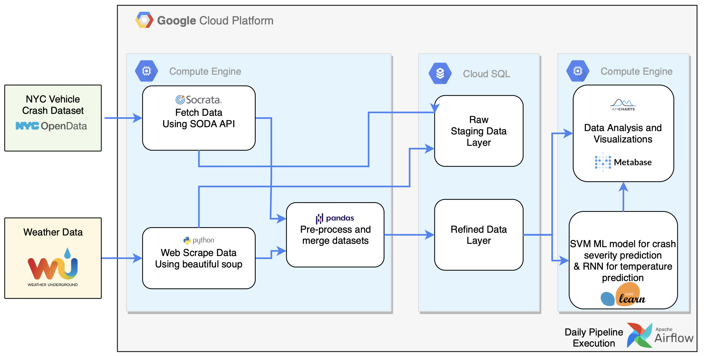

# NYC Vehicle Crash Analysis

### This repository has the code components for the project for EECS 6892 Big Data Analytics in Fall 2021

Team Members: Shivam Ojha(so2639), Abhishek Arora(aa4822), Animesh Bhasin(ab5051)


## System Architecture



## Organization of this directory

```
./
├── README.md
├── analysis_and_predictions
│   ├── analyze_crash.py
│   ├── merge_datasets.py
│   └── predict_weather.py
├── get_crashes.py
├── get_weather.py
├── load_full_crashes_data.py
├── nyc_vehicle_crash_analysis_dag.py
├── preprocess_crash_data.py
├── preprocess_weather_data.py
├── requirements.txt
├── utils
│   └── gmaps_api.py
└── visualizations
    ├── css
    │   └── style.css
    ├── index.html
    ├── js
    │   ├── am_bar_1.js
    │   ├── am_bar_chart_race.js
    │   ├── am_donut_pie.js
    │   ├── am_heatmap.js
    │   ├── am_stacked_column_chart.js
    │   ├── heatmap.js
    │   └── script.js
    └── json
        ├── config.json
        ├── data.json
        └── heatmap.json

6 directories, 24 files
```